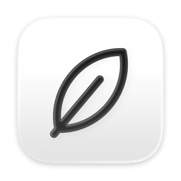

<p align="center">
  
</p>

# Bosk

A small, fast, opinionated web browser for macOS, built on WebKit.

**Private by design.** No telemetry and no bloat. Speed comes first.

- Tabs live in a sidebar and pinned tabs sit in a grid. The sidebar can fold into a strip, or you can hide it.
- Tabs you aren't using go to sleep to keep memory low. You choose the delay in Settings, or turn sleep off. Pinned tabs stay awake.
- Chrome extensions work through WebKit's `WKWebExtension`.
- A built-in ad and tracker blocker (EasyList and EasyPrivacy). You can turn it off in Settings, or for one site.
- Reader Mode, powered by [Defuddle](https://github.com/kepano/defuddle) by [kepano](https://github.com/kepano).

Requires macOS 26 or later.

## Install

With [Homebrew](https://brew.sh):

```bash
brew install --cask tbergeron/bosk/bosk
```

Or download the DMG from [Releases](https://github.com/tbergeron/bosk-browser/releases/latest),
open it, and drag Bosk to Applications.

Bosk updates itself (Bosk > Check for Updates…). If you installed with Homebrew,
`brew upgrade --cask bosk` also works. To remove Bosk and all its data:

```bash
brew uninstall --zap --cask bosk
```

## Privacy

Bosk has no backend and needs no account. It collects nothing about you: your history, tabs and
settings stay on your Mac. Once a week, the ad blocker downloads its filter lists from easylist.to.
That request sends no cookies and nothing about you.

## Known issues

- **Dark Reader sometimes gets stuck.** Its popup shows "Loading, please wait", and pages get a
  plain, broken dark style, even on sites where Dark Reader is off. Its background stops
  answering, so the early dark style it adds to each page never goes away. The cause is not known
  yet. *To fix it for now, turn Dark Reader off and on again in Settings > Extensions, then reload
  the pages.*
- **Bitwarden from the Chrome Web Store freezes after you log in.** It opens a WebSocket from its
  service worker, and WebKit locks up there, so the popup and the icon stop working. Use the Safari
  build instead: in Settings, load an unpacked extension from
  `/Applications/Bitwarden.app/Contents/PlugIns/safari.appex/Contents/Resources` (this needs the
  Bitwarden Mac app).

## Build

```bash
brew install xcodegen
xcodegen generate
open Bosk.xcodeproj
```

Core logic tests:

```bash
swift test --package-path Packages/BoskCore
```

## Documentation

- [docs/perf-budgets.md](docs/perf-budgets.md): speed and memory budgets, and how to measure them
- [docs/extension-compat.md](docs/extension-compat.md): tested Chrome extensions and WebKit's gaps
- [docs/manual-checklist.md](docs/manual-checklist.md): checks that need a person, before a release
- [docs/release.md](docs/release.md): signing, notarization and Sparkle updates

## Scripts

| Script | What it does |
|---|---|
| `scripts/test-pages.py` | Local test pages (dialogs, pop-ups, downloads, sign-in, forms, ads) |
| `scripts/test-extension/` | A small Manifest V3 extension to test extension support |
| `scripts/measure-memory.sh` | Total memory of a running Debug build and its WebKit processes |
| `scripts/measure-hitches.sh` | Instruments hitch trace of the sidebar and tab switching |
| `scripts/release.sh` | Signed, notarized DMG and Sparkle appcast |

## Contributing

Bosk is small on purpose. Every feature has to earn its place, and speed and low memory come
first. Pull requests are welcome, most of all fixes, speed and memory gains, and polish. If you
want to build a large new feature, open an issue first so we can talk about whether it fits.

## License

MIT
